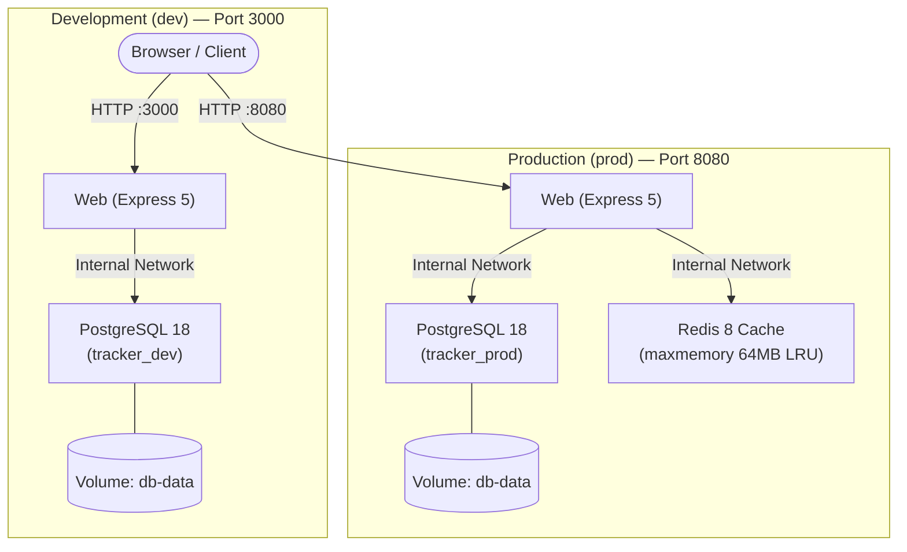

# IT Incident Tracker — Multi-Environment Deployment

<p align="left">
  
  
  
  
  
  
</p>

---

## 1. Overview & Architecture

Multi-container IT incident tracker deployed across two isolated environments: **Development (`dev`)** and **Production (`prod`)**.

### System Architecture



### Cache-Aside Pattern (Production)
- **Read (`GET /api/incidents`):** Checks Redis first (`X-Cache: HIT`, <1 ms). On miss, queries PostgreSQL aggregated over 50,000 seed records (`X-Cache: MISS`, ~10 ms) and caches the result for 60s.
- **Write (`POST /api/incidents`):** Inserts into PostgreSQL and immediately invalidates the Redis cache key.
- **Resilience:** If Redis fails, the web service automatically falls back to PostgreSQL (`HTTP 200`, status: `degraded`).

---

## 2. Environment Comparison

| Parameter | Development (`dev`) | Production (`prod`) |
| :--- | :--- | :--- |
| **Compose File** | `docker-compose.dev.yml` | `docker-compose.prod.yml` |
| **Port** | `127.0.0.1:3000` | `127.0.0.1:8080` |
| **Cache (Redis)** | Disabled (`CACHE_ENABLED=false`) | Enabled (`redis:8-alpine`, 64MB LRU) |
| **Database** | `tracker_dev` (PostgreSQL 18) | `tracker_prod` (PostgreSQL 18) |
| **Persistence** | Named volume (`db-data`) | Named volume (`db-data`) |
| **Resource Limits** | Uncapped | Web: 256MB, DB: 512MB, Cache: 128MB |
| **Restart Policy** | Default (no restart) | `unless-stopped` |
| **Log Level** | `debug` (logs requests & timings) | `info` (lifecycle events only) |
| **Network** | `backend` internal network | `backend` internal network |

---

## 3. Quick Start

### Prerequisites
- Docker Engine 24+ & Docker Compose v2+
- `make`, `curl`, `openssl`, `bash`

### Setup and Run
```bash
# 1. Generate .env.dev and .env.prod with secure random passwords (chmod 600)
make setup-env

# 2. Start Development environment (http://127.0.0.1:3000)
make up-dev

# 3. Start Production environment (http://127.0.0.1:8080)
make up-prod

# 4. View container status and health
make ps
```

### Stop or Clean
```bash
# Stop containers (keeps persistent database volumes)
make down

# Clean everything (deletes containers, networks, volumes, and images)
make clean
```

---

## 4. Healthchecks & Resilience

1. **Liveness Probe (`/live`):** Configured in `Dockerfile`. Only checks that the Node.js process is responsive. Never touches PostgreSQL or Redis, preventing restart loops during dependency downtime.
2. **Readiness & Service Status (`/status` & `/health`):**
   - Probes PostgreSQL (`SELECT 1`) and Redis (`PING`) concurrently with a 2s timeout.
   - **All services up:** `HTTP 200` (`status: "ok"`).
   - **Redis down in prod:** `HTTP 200` (`status: "degraded"`), app stays operational.
   - **PostgreSQL down:** `HTTP 503` (`status: "degraded"`), UI indicates disconnection dynamically.
3. **Container Healthchecks:**
   - **Web:** Probes `http://127.0.0.1:3000/live`.
   - **DB:** Probes `pg_isready -h 127.0.0.1` over TCP (ensures `init.sql` seed finishes before marking healthy).
   - **Cache:** Probes `redis-cli ping` with authentication.
   - Services use `depends_on: condition: service_healthy` to eliminate startup race conditions.

---

## 5. Security Measures

- **No Root:** Web runs as `node` (UID 1000), DB as `postgres`, Redis as `redis` (UID 999).
- **Hardened Containers:** `read_only: true`, `cap_drop: [ALL]`, `no-new-privileges: true`.
- **Network Isolation:** Only the web service is published to localhost (`127.0.0.1`). DB and Redis are isolated inside an `internal: true` backend network with zero exposed host ports.
- **Secret Management:** Secrets generated via `openssl rand -hex 24`, stored in `chmod 600` `.env` files, ignored by Git and Docker build contexts.
- **App Security:** Parameterized SQL queries (no SQLi), strict CSP headers, 10KB request size limits.

---

## 6. Verification & Automated Tests

A comprehensive end-to-end verification suite covers **113 checks** across configuration, networking, persistence, caching, and failover:

```bash
make test
```

> **Full Test Execution Log:** Captured in [docs/evidence/test-results.txt](docs/evidence/test-results.txt) (`113 passed, 0 failed`).

### Performance Metrics (Real Test Run)
- **Cache MISS (PostgreSQL scan over 50,000 records):** `~9.51 ms`
- **Cache HIT (Redis RAM):** `~0.61 ms`
- **Speedup:** **>15x faster**

---

## 7. Makefile Commands

| Command | Description |
| :--- | :--- |
| `make help` | Show all available targets with descriptions |
| `make setup-env` | Create `.env.dev` and `.env.prod` with random secrets (mode 600) |
| `make build` | Build Docker images for both environments |
| `make up-dev` | Start Dev environment (`web` + `db`) |
| `make up-prod` | Start Prod environment (`web` + `db` + `cache`) |
| `make down` | Stop environments (preserves data volumes) |
| `make clean` | Stop and remove containers, networks, volumes, and images |
| `make ps` | List containers and healthcheck status |
| `make status` | Query `/status` endpoints via curl |
| `make logs` | Stream logs for `web` (`ENV=dev` or `ENV=prod`) |
| `make test-db` | Verify PostgreSQL connection and count records (`ENV=dev|prod`) |
| `make test-cache` | Verify Redis connection with PONG |
| `make kill-db` / `make start-db` | Simulate DB failure / recovery (`ENV=dev|prod`) |
| `make kill-cache` / `make start-cache` | Simulate Redis failure / recovery (prod only) |
| `make test` | Run complete 113-check automated test suite |
| `make demo` | Run interactive guided walkthrough for practice defense |

---

## 8. Interactive Defense Demo (`make demo`)

For defending the project in front of the evaluator, run:

```bash
make demo
```

The script guides through 5 key demonstrations with color-coded steps:
1. **Environments & Ports:** Verifies Dev (port 3000, no cache) vs Prod (port 8080, with Redis).
2. **Data Persistence:** Creates a record, stops containers with `down`, recreates them, and shows data persisted in the volume.
3. **Cache Speed & Invalidation:** Demonstrates Cache MISS vs HIT timing and automatic invalidation on `POST`.
4. **Resilience & Healthchecks:** Kills Redis (degraded mode, HTTP 200) and DB (HTTP 503), then recovers both live.
5. **Security:** Confirms internal network routing and non-root process IDs.

---

## 9. AI Tools Declaration

In accordance with citation and declaration guidelines:

### 1. Claude Sonnet 5.5 (Anthropic)
- **Tool Name & Version:** Claude Sonnet 5.5 (Anthropic)
- **Specific Purpose:** Web application architecture and implementation, routing design, database schema queries, and coding assistance.
- **Applied Parts:** Web application codebase (`src/` — Express server, REST endpoints, database integration, Redis caching layer, and frontend UI).

### 2. Gemini 3.8 Flash / Antigravity AI Agent (Google DeepMind)
- **Tool Name & Version:** Gemini 3.8 Flash (High) / Antigravity AI Agent (Google DeepMind)
- **Specific Purpose:** Designing end-to-end resilience and security test suite (`scripts/test.sh`), Docker Compose container hardening, interactive defense demo script (`scripts/demo.sh`), and documentation diagrams.
- **Applied Parts:** Test automation suite, guided defense demo, and README technical documentation.
